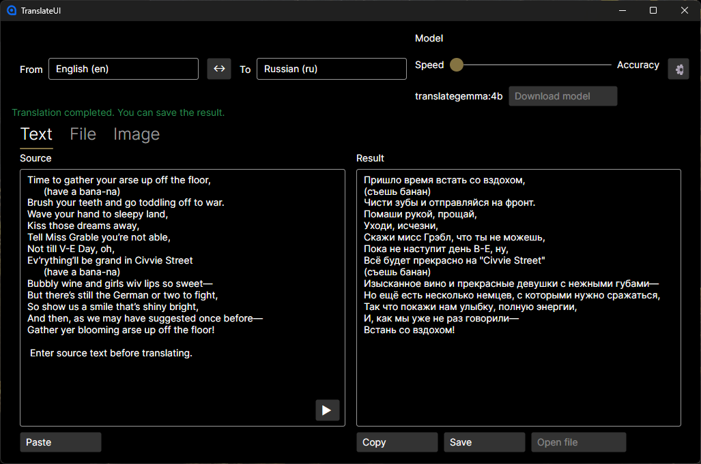

# TranslateUI

🇬🇧 English | 🇷🇺 [Русский](README.RU.md)

A minimalistic desktop translator built on **Ollama** + **TranslateGemma**.  
Target stack: **.NET 10**, **C# 14**, **Avalonia UI**, **MVVM**. No paid libraries.

## Goals
- Translate text, files, and (optionally) images.
- Provide strict aesthetic UI with adaptive layout and tray support.
- Stay lightweight in RAM/CPU/Disk usage.

## Features
- **Text translation**: source/target panels, translate on button click, option to save result.
- **File translation**: file picker or drag&drop, choose output path, link to open result.
- **Image translation**: only when a vision-capable model is available.
- **Language selection**: source/target languages based on `translategemma.MD`.
- **Model selection**: discrete slider (4B, 12B, 27B) with “Speed → Accuracy”.
- **Model download**: warning if missing, direct download or auto-download before translate.
- **Clipboard**: paste source, copy/save result.
- **Tray**: left-click opens the app; menu: Open/Translate/Exit.
- **Tray translate**: translates clipboard text, image, or file into the right tab.
- **Close behavior**: confirm close, minimize to tray, or exit with “don’t ask again”.
- **Debug logging**: configurable log level and log path in settings.
- **Version**: displayed in settings and set in CI on `releases/*.*.*` builds.

## How to Use
- Launch the app and pick source/target languages.
- **Text** tab: type or paste text, then press the translate button (▶).
- **File** tab: choose or drag&drop a supported file, pick output path, then translate.
- **Image** tab: available only with vision-capable models; select an image to translate.
- **Tray > Translate**: translates clipboard content (text, image, or file) and opens the right tab.
- **Settings**: configure UI language, default model, logging, and close behavior.

## Releases
- Download prebuilt binaries from GitHub Releases: https://github.com/somadhy/TranslateUI/releases

## Requirements Snapshot
- **Supported formats**: PDF, TXT, MD, DOCX, ODT, PNG, JPEG, TIFF.
- **Settings**: default languages, Ollama URL, default model, UI language.
- **Exit behavior**: choose close confirmation and action (exit/minimize to tray).
- **Logging**: configurable log level (Debug/Info/Warn/Error/Off).
- **Security**: safe file access, no arbitrary execution, sanitize paths.

## Getting Started (Developer)
- Install **.NET 10 SDK** and **Ollama**.
- Ensure Ollama is running (`http://localhost:11434` by default).
- Download model if needed: `ollama pull translategemma:4b`.
- Build: `dotnet build`
- Test: `dotnet test TranslateUI.Tests/TranslateUI.Tests.csproj`

## Documentation Map
- `docs/01-Requirements.md` — functional and non-functional requirements
- `docs/02-Architecture.md` — MVVM structure, services, patterns
- `docs/03-UI-UX.md` — layouts, interactions, tray behavior
- `docs/04-Ollama-Integration.md` — HTTP endpoints, model handling
- `docs/05-File-Formats.md` — extraction/output strategies
- `docs/06-Prompting-Languages.md` — prompt format + language list usage
- `docs/07-Settings-Localization.md` — settings and resources
- `docs/08-Testing.md` — unit/integration/UI test guidance
- `docs/09-Security.md` — security and safety checklist
- `docs/10-Implementation-Plan.md` — phased delivery plan

## Licensing
Use only free/open-source libraries.
